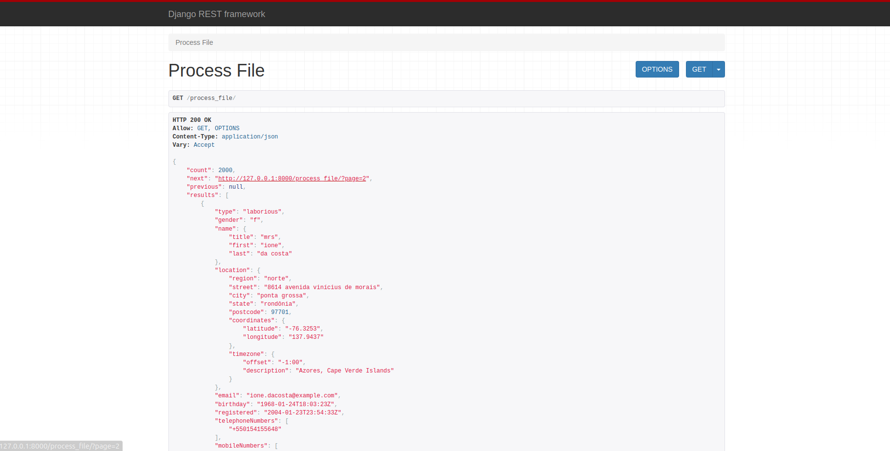

# Process Client's Files

This repo contains a small project focused to load, parse, standarize, paginate and return as an API data related to our clients.

## Setting Up the Environment

    docker-compose up --build

If everything worked fine, you'll be able to see the expected screen shown bellow, here:

    0.0.0.0:8000/process_file/

## Tests

To run the unit tests, you need to access the backend container:

    docker exec -it juntossomosmais_backend_1 /bin/bash

and run:

    pytest

Note: We currently have 5 tests (backend/fibonacci/tests/test_views.py).